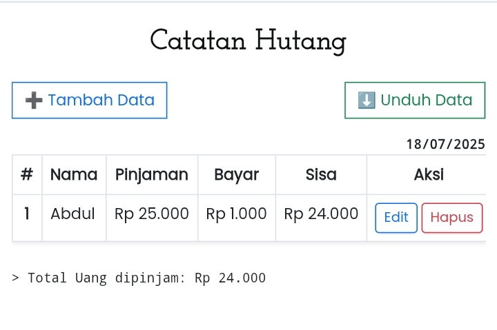

# 📒 Catatan Hutang Sederhana


> Web aplikasi sederhana untuk mencatat hutang secara praktis, disimpan di LocalStorage, dengan tampilan modern berbasis Bootstrap.

---

## 📸 Screenshot



---

## ✨ Fitur

* ✅ Tambah catatan hutang baru
* ✅ Edit catatan hutang yang sudah ada
* ✅ Hapus catatan hutang
* ✅ Hitung total pinjaman secara otomatis
* ✅ Data disimpan di LocalStorage
* ✅ Nominal otomatis diformat dalam Rupiah
* ✅ Responsif & ringan

---

## 🔗 Teknologi yang Digunakan

* [HTML5](https://developer.mozilla.org/en-US/docs/Web/HTML)
* [CSS3](https://developer.mozilla.org/en-US/docs/Web/CSS) dengan [Bootstrap 5.3](https://getbootstrap.com)
* [Vanilla JavaScript](https://developer.mozilla.org/en-US/docs/Web/JavaScript)

---

## 📦 Cara Menjalankan

1️⃣ **Clone repo ini**

```bash
git clone https://github.com/nan720/catatan-hutang.git
```

2️⃣ **Buka file `index.html` di browser**

Tidak butuh server, backend, atau database. Semua data tersimpan di LocalStorage browser Anda.

---

## 📚 Tujuan Proyek

Proyek ini dibuat sebagai bahan pembelajaran untuk:

* Membuat aplikasi CRUD sederhana
* Mengenal LocalStorage untuk penyimpanan sisi klien
* Menggunakan Bootstrap untuk tampilan yang modern & responsif
* Belajar memformat nominal Rupiah di JavaScript

---

## 🪪 Lisensi

Proyek ini dilisensikan di bawah lisensi [MIT](LICENSE).
